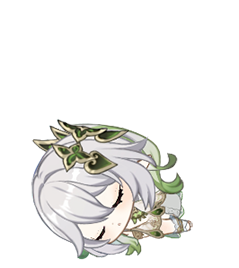

# 🐾 桌面宠物 (Desktop Pet)

基于 **Qt5** 开发的桌面伙伴应用，使用帧动画在桌面上展示一个可爱的宠物角色。

## 📸 截图

<div align="center">
  
  
  
</div>

## ✨ 功能特性

### 🎬 三种动画状态

| 状态 | 说明 | 帧数 | 触发方式 |
|------|------|------|----------|
| **SayHello** 👋 | 打招呼动画 | 28 帧 | 启动时自动播放；鼠标点击宠物时触发 |
| **Swing** 🎠 | 摇摆动画 | 17 帧（经平滑处理扩展为双向循环） | SayHello 播放完毕后自动切换；持续 **2 分钟** 后进入睡眠 |
| **Sleep** 😴 | 睡觉动画 | 25 帧 | 摇摆 2 分钟后自动进入；点击宠物可唤醒 |

### 🖱️ 交互方式

- **点击宠物** → 触发 SayHello 打招呼动画
- **拖拽移动** → 左键按住拖拽窗口（睡眠状态下禁止拖拽）
- **右键菜单** → 弹出功能菜单（菜单位于窗口右侧或下方）

### 🔧 系统托盘功能

| 功能 | 操作 |
|------|------|
| **🖥️ 唤起 Agent** | 自动检测终端模拟器，在终端中启动 `deepy tui` AI 助手 |
| **🧹 释放内存** | 调用 `sync()` + `malloc_trim(0)` 释放系统缓存 |
| **ℹ️ 关于** | 显示版本、动画状态和交互方式说明 |
| **❌ 退出** | 退出应用（关闭窗口仅隐藏到托盘） |

- **左键点击托盘图标** → 切换窗口显示/隐藏
- **关闭窗口** → 最小化到托盘（不退出）

## 🏗️ 项目结构

```
desktop_pet/
├── main.cpp                # 程序入口
├── mainwindow.h            # 主窗口头文件（PetState 枚举、MainWindow 类）
├── mainwindow.cpp          # 主窗口实现（动画、交互、托盘）
├── mainwindow.ui           # UI 布局
├── desktop_pet.pro         # qmake 项目文件
├── desktop_pet_zh_CN.ts    # 中文翻译文件
├── img/
│   ├── icon.png            # 托盘图标
│   ├── sayHello/           # "打招呼" 动画帧（28 张 PNG）
│   ├── swing/              # "摇摆" 动画帧
│   └── sleep/              # "睡觉" 动画帧（25 张 PNG）
├── plans/                  # 规划文档
└── README.md
```

## 🛠️ 构建与运行

### 环境要求

- **Qt 5.x**（Core, Gui, Widgets）
- **C++11** 编译器（g++ / clang++）
- **qmake** 构建系统

### 构建步骤

```bash
# 1. 生成 Makefile
qmake desktop_pet.pro

# 2. 编译
make

# 3. 运行
./desktop_pet
```

### 在 Qt Creator 中打开

直接用 Qt Creator 打开 `desktop_pet.pro` 文件，配置好 Qt 版本后构建运行即可。

## ⚙️ 技术细节

- **动画引擎**：60ms 帧间隔（约 16.6 FPS），100ms 状态计时器
- **帧加载**：图片从 `PROJECT_ROOT/img/<state>/` 目录运行时加载，按文件名数字自然排序
- **平滑处理**：`smoothSwingAnimation()` 将摇摆动画处理为正向 → 反向的平滑循环
- **窗口样式**：无边框、透明背景、窗口置顶，220×220 像素圆形区域
- **托盘菜单**：绿色系 CSS 样式，圆角毛玻璃效果

## 📄 许可证

本项目仅供学习和个人使用。
